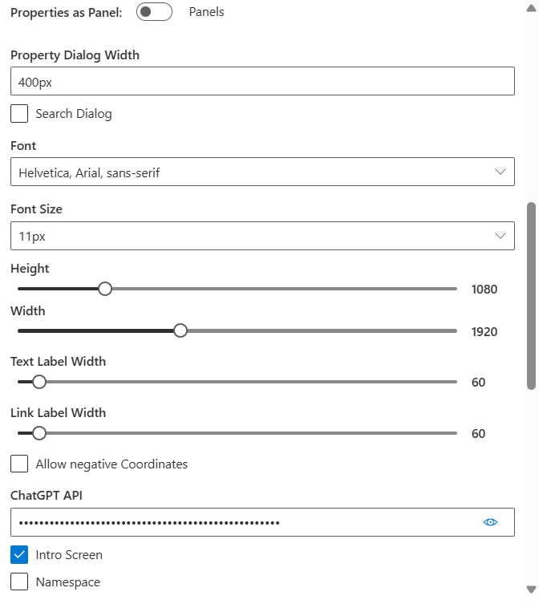
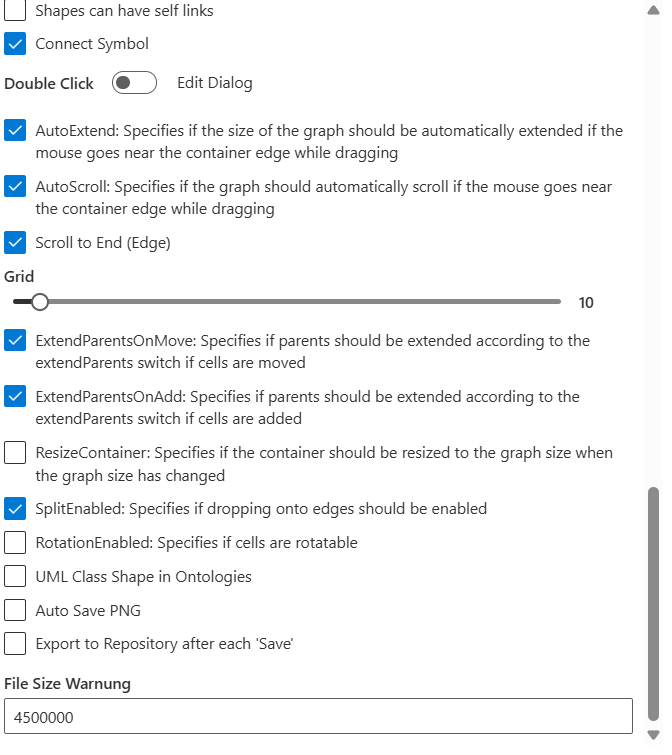
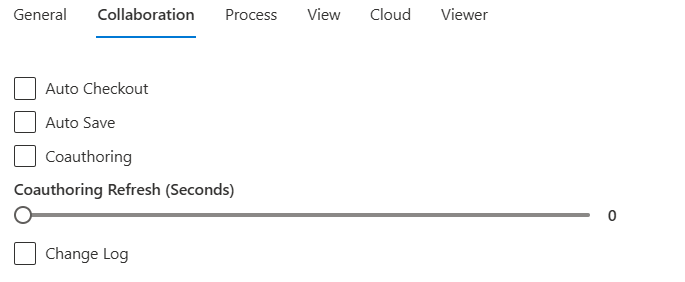
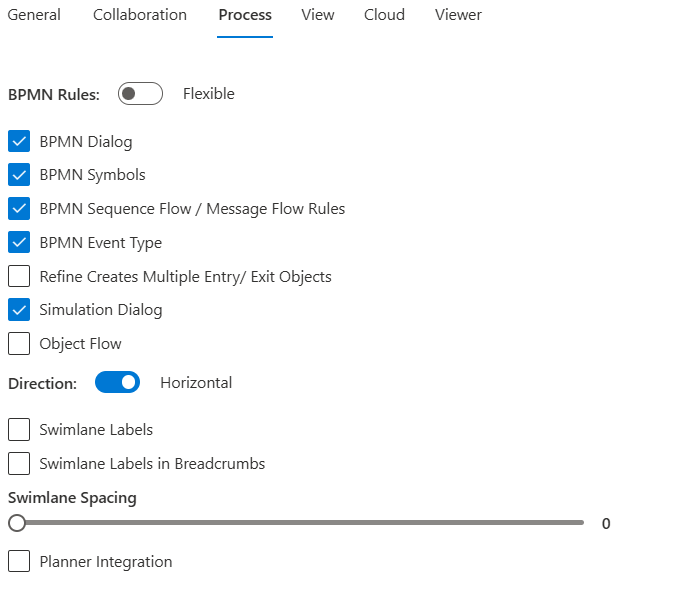
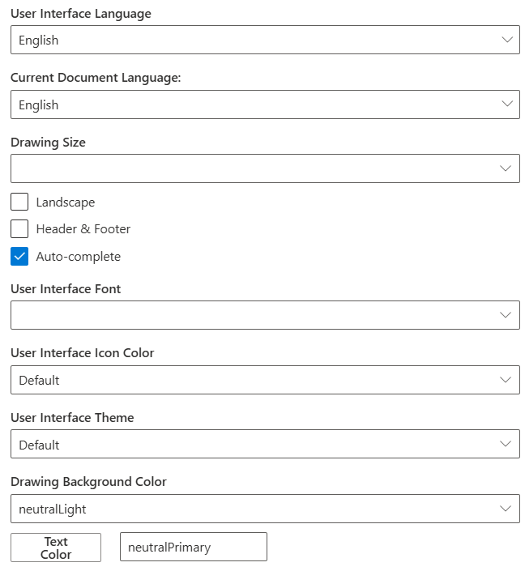
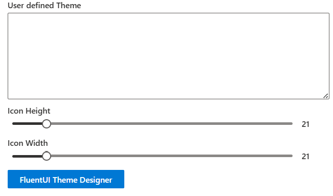
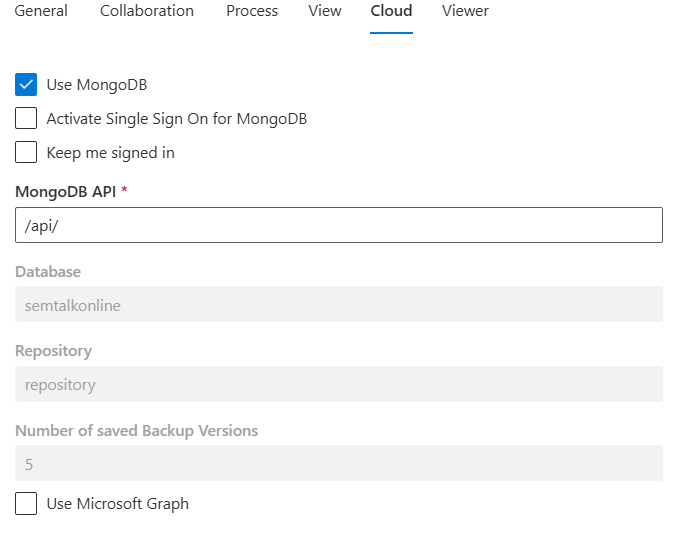
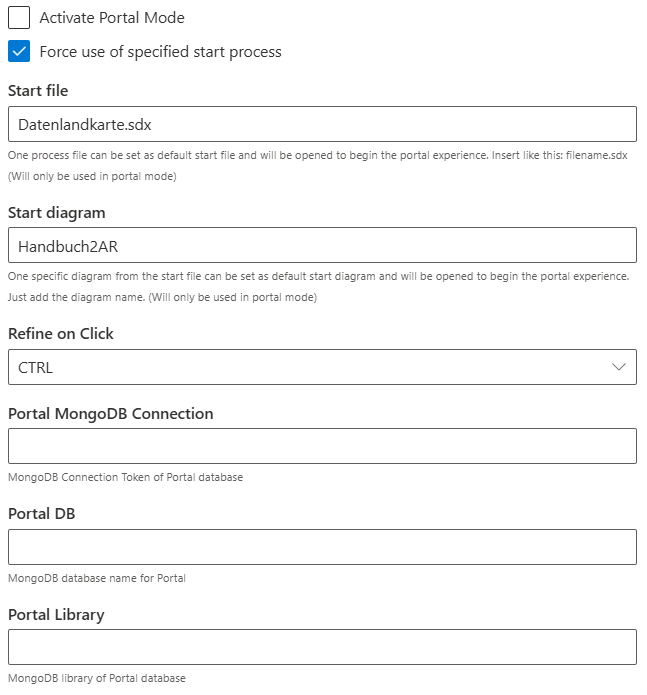
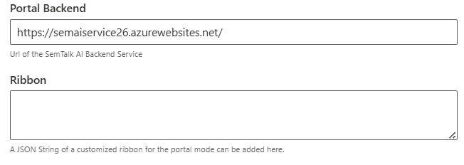

# Settings

**General**

* Ribbon: Show or hide Toolbar
* Toolbar: Show settings on Tools tab
* Breadcrumb Navigation: Shows the Breadcrumb Diagram navigation bar
  
**Anchor**

- This feature allows the modeller to customise how the tools they have are shown on the UI, specifically allowing these tools to be anchored on the right or left side of the screen. The modeller may also use the floating option in which case these items appear at as smaller windows that may be moved around the screen in the program. (it is recommended that no more than two anchors be put on either side of the UI)
* **Anchor** Pan & Zoom
* **Anchor** Stencil
* **Anchor** Properties
* **Anchor** Chatbot
* **Anchor** Navigator
  
* Show Marker at Hyperlinks: Show or hide paperclips on Tasks to show that there are available Attachments
* Underline Refinements: Shows if Refinements should be viewed as underlined Task names
* Semntalk Copilot
* Quick Shapes: Turns on and off Object Quick Shapes that show available Objects that can be connected and it automatically draws the connector to the newly created Object

  
* Properties as Panel
* Property Dialog Width
* Search Dialog
* Font (Parameters): Selects Font, Font Size, Height, and Width for scaling to other applications (e.g. SharePoint)
* ChatGPT API
* Intro Screen
* Shapes 
* Name Space

  
* Shapes can have self links
* Connect Symbol
* Double Click 
* Auto Extend
* Auto Scroll
* Scroll to End
* Grid
* ExtendParentsOnMove
* ExtendParentsOnAdd
* ResizeContainer
* Split Enabled
* Rotation Enabled
* UML Class Shape in Ontologies
* Auto Save PNG
* Export to Repository after each 'Save'
* File Size Warning

**Collaboration**

 

* Auto Checkout
* Auto Save
* Coauthoring
* Change Log

**Process**

 

* BPMN Rules
* BPMN Dialog
* BPMN Sequence Flow/ Message Flow Rules
* BPMN Event Type
* Refine Creates Multiple Entry/ Exit Objects
* Simulation Dialog
* Object Flow
* Direction
* Swimlane Labels
* Swimlane Labels in Breadcrumbs
* Swimlane Spacing
* Planner Integration

**View**

 

* User interface Language
* Current Document Language
* Drawing Size
* Landscape
* Header & Footer
* Auto-Complete
* User Interface Font
* User Interface Icon Color
* User Interface Theme
* Drawing Background Color
* Text Color: Change the text color of the current Diagram

 

* User defined Theme
* Icon Height
* Icon Width
  
**Cloud**

 

* Use MongoDB
* Activate Single Sign On for MongoDB
* Keep me signed in
* Use Microsoft Graph

**Viewer**

 

* Activate Portal Mode
* Force use of Specified start Process
* Start file
* Start Diagram
* Refine on Click
* Portal Mongo DB COnnection
* Portal DB
* Portal Library

 
  
* Portal Backend
* Ribbon
