# Settings

Settings are used to structually and visually customize SemTalk Online.

Settings have multiple functions. For example, they:
 
  * Show what is shown or hidden in the modeling environment,
  * Set the **Shape**, **Navigation** and placement options on **Diagrams**,
  * Customize **Pull-Down Menues & Layout**,
  * Determine relevant **Properties** for each **Object** type, and
  * Link models to external content and tools, 

**General - Settings - Pull-Down Menu**

Click on the gear icon  found to the far right of the Pull-Down menu to open General Setting.

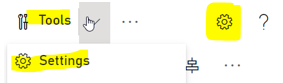

The following **General Settings** Window will open.

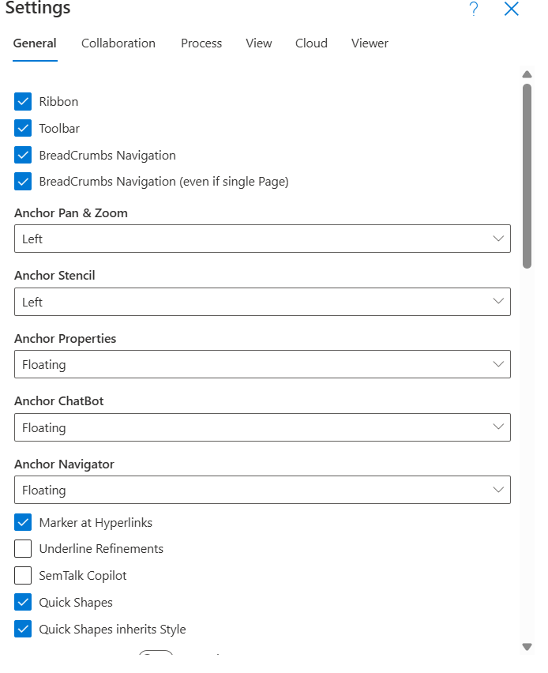

### Settings - General: ###

  * **Ribbon**: Shows or hides Toolbar
  * **Show Toolbar**: Shows or hides Toolbar
  * **BreadCrumb Navigation**: Shows the Breadcrumb Diagram Navigation Bar under the Toolbar. This allows users to quickly navigate to connected higher and lower process **Diagrams**.
  * **BreadCrumb Navigation (even if a single page)**: Shows Diagram Name for single, unlinked pages

  * **Anchor** Commands: Used to show or hide **Pan & Zoom**, **Stencil**, **Properties**, **ChatBot** and **Navigation** Windows. 

 **NOTE**: Modeling tool windows are generally turned on and off when working between the modeling enviroment and showing model data to end-users.
  * **Marker at Hyperlinks**: Shows Hyperlink markers on Objects with linked Documents and Pages.
  * **Underline Refinements**: Underlines the Object's name to show that the Object has an associated **Refinement**.
   * **Left, Right or Floating**:  **Pan & Zoom**, **Stencil**, **Properties**, **ChatBot** and **Navigation** windows can be anchored to the Left or Right or they can be floated on top of the open Diagram
  * **SemTalk CoPilot**: Integrates model data with CoPilot features that are able to suggest next steps or to replace existing model data with data linked via BPMN models. If there is not associated **BPMN** model data, external Object data can be integrated via **Knowledge Graphs**.

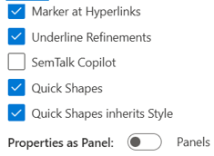

**Quick Shapes**: Modelers can rapidly add Objects and Connectors directly from existing **Business Process Diagram Objects** onto the active **Diagram**. Available **Objects** and **Connectors** are shown when the cursor is hovered over an existing **Business Process Diagram Object**. **Quick Shape** features and **Style** can be activated for all future **Business Process Diagram Objects** by turning on **Quick Shapes inherits Style**.

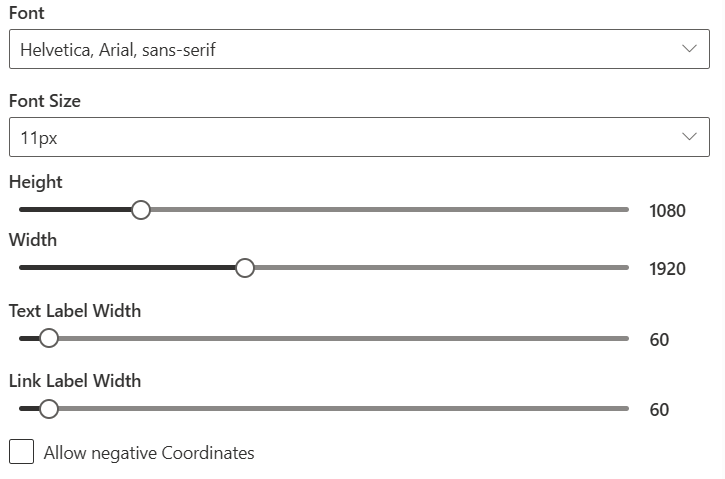

  * **Property Dialog**: Sets the **Format** and **Style** of **Properties**
  * **Allow Negative Coordinates**: Allows 
  **Diagram Objects** to be visualized without Page Layout constraints. 

  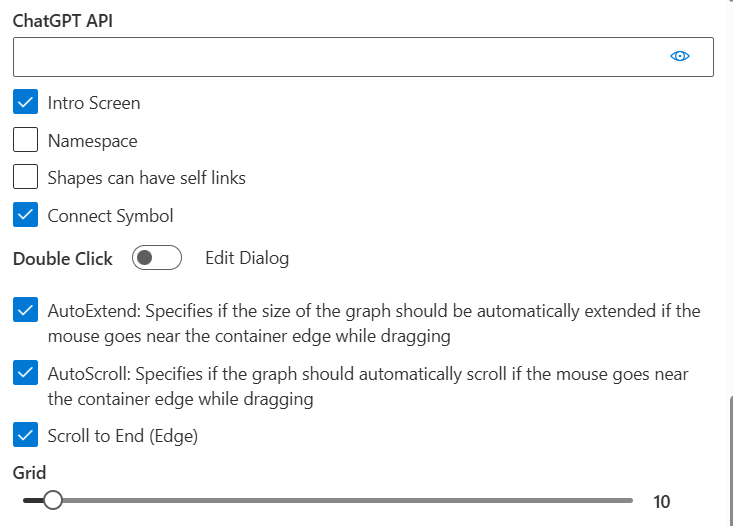

 
  * **ChatGPT API**: Allows modelers to add an access key for their ChatGPT app
 * **Intro Screen**: Turns on and off the **Welcome Screen** that appears when SemTalk Online opens
 * **Namespace**: Adds the **Namespace** Adds a '#' plus Object type abbreviation before an Object's name. This is used primarily when creating Ontologies.

 * **Dialog View**: 
* **Font (Parameters)**: Selects Font, Font Size, Height, and Width for scaling to other applications (e.g. SharePoint)
**Symbol Scale Factor**: Scales all symbol shapes in the model
* **Resize**: Allows all shapes to allow users to determine their shape size. When selected, Style Resize is set to 'on'.

#### Additional Customization General Settings:

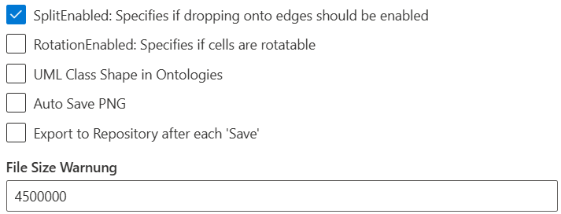

  * **SplitEnable**: Allows modelers to add Objects between two Objects on a Process Diagram so that the new Connectors are generated automatically
  * **RotationEnabled**: When enabled, individual Objects can be rotated. Click on an Object and a blue dot will appear. Click on the blue dot and rotate the Object as needed. NOTE: After turning on RotationEnabled, refresh your model to activate.
  * **UMLClass Shape in Ontologies**: Allows Class models to be shown as standard UML class representations.
  * **Auto Save png**: Saves added .png files that can be used by other modelers. Caution must be used when this setting is turned on because it greatly increased the model file size.
  * **Export to Repository after each 'Save**: This setting is used by Model Administrators and Editors to upload Objects into a general shared Repository

### **Setting - Collaboration**

* Auto Checkout
* Auto Save
* Coauthoring
* Change Log

### **Settings - Process**

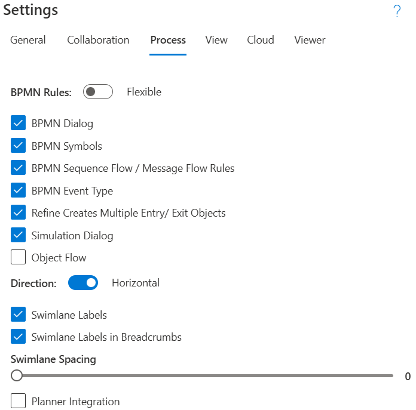

* BPMN Rules
* BPMN Dialog
* BPMN Sequence Flow/ Message Flow Rules
* BPMN Event Type
* Refine Creates Multiple Entry/ Exit Objects
* Simulation Dialog
* Object Flow
* Direction
* Swimlane Labels
* Swimlane Labels in Breadcrumbs
* Swimlane Spacing
* Planner Integration

### **Settings - View**

**Language Settings in SemTalk Online**: SemTalk differentiates between the User Interface language and the model's Document Language used for naming Objects and Connections. 

  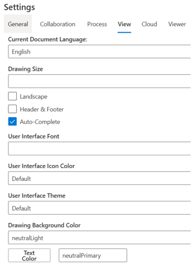
  
  **User Interface Language**: SemTalk Online supports the following 9 languages.

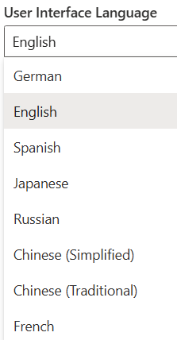

**User Interface Language** Settings are SemTalk Online Commands. Edits are managed by the SemTalk Online development team.

* **Current Document Language**: The Document Language is the language used when naming Objects, 
Diagrams and other content such as Comments. Multiple Document Languages are managed via Reports that can have columns of multiple langages that can be imported to show content based on the local language of the readers.
* Drawing Size
* Landscape
* Header & Footer
* Auto-Complete

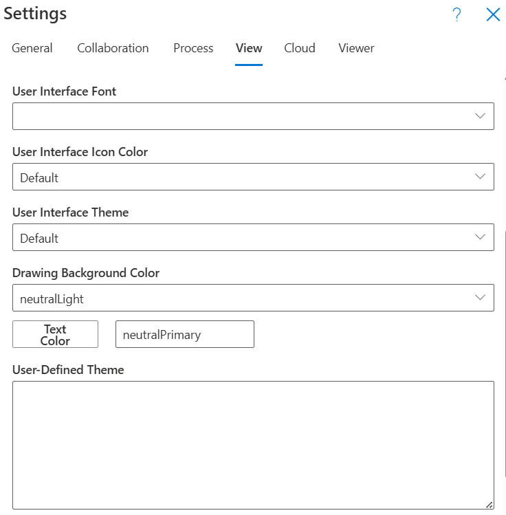

User Interface **Font** Settings:
* User **Interface Font**
* User **Interface Icon Color**

**Fluent UI Themes**: Structured, design-token-based parameters used to define the visual appearance of an application that include colors, typography, and spacing—of Objects across the modeling environment.

* **User Interface Theme**: SemTalk Online includes the following Theme options. Modelers can adjust available Themes using the **User-Defined Theme** function.

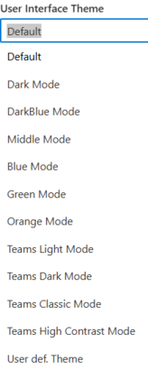

* **Drawing Background Color**: This is the default color for Diagram backgrounds
* Text Color
* **User-Defined Theme**: If modelers or organizations have defined Themes, code for predefined  **Themes**, can entered here. Luent UI Themes can be created https://fluentuipr.z22.web.core.windows.net/heads/master/theming-designer/index.html

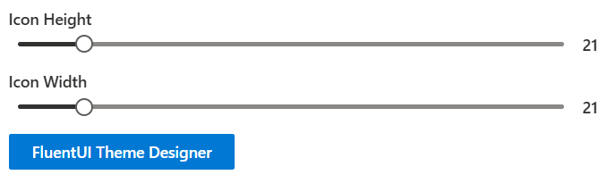

* Icon Height
* Icon Width
  
**Settings - Cloud**

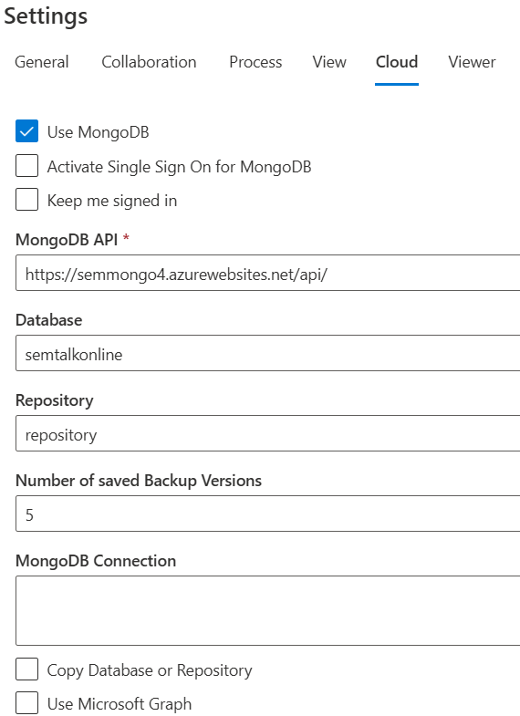

**Settings - Cloud** is used to:
* Set External Connections to and from SemTalk Online,
* Define Backup Options,
* Copy Database and Repository information and to
* Use Microsoft Graph

MongoDB: MongoDB is the standard format for Object
* Activate Single Sign On for MongoDB
* Keep me signed in
* Use Microsoft Graph

**Viewer**
* Activate Portal Mode
* Force use of Specified start Process
* Start file
* Start Diagram
* Refine on Click
* Portal Mongo DB COnnection
* Portal DB
* Portal Library
* Portal Backend
* Ribbon
