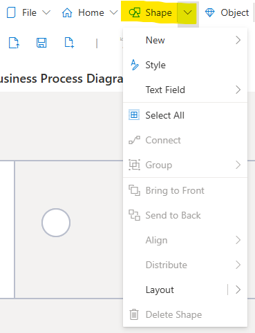

# Shapes

The **Shape Pull-Down Menu** is where the appearance and placement of Shapes is managed. It is also used to add, delete and edit non-SemTalk Object GUI Shapes that are added as visual aids to help model viewers to better understand the model information.

## Shape Pull-Down Menu

**NOTE**: If a SemTalk Object Shape is not first selected, pull-down settings will add, delete and edit non-SemTalk Object GUI Shapes. If a SemTalk Object is selected, the Shape pull-down menu will create, edit and manage SemTalk Object Shape data.

**New**: Shows the **Shapes** that can be inserted onto the active Diagram. Select a Shape. A matching Shape will be created that can be edited as needed using the right mouse click Style option.

**Style**: Opens the **Style** dialog to edit the appearance of a selected Shape. See [Style](https://github.com/SemTalkOnline/SemTalkOnline/wiki/Style)

**Connect**: Select two or more **Shapes** to automatically draw **Connectors** between the **Shapes**.

**Group**: Select multiple modeling Objects and Artifacts on a Diagram to Group them together. 

**Bring to Front/Send to Back**: When modeling elements are graphically layered, users can select if the Shape should be displayed in the foreground or background.

**Align/Distribute**: Aligns a large number of selected **Shapes** so that they are easier to visualize. 

**Layout**: Makes the connection points on the Shape visible.

**Delete** (Symbols): Deletes the selected Shape from the Diagram.
