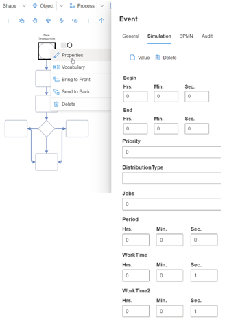
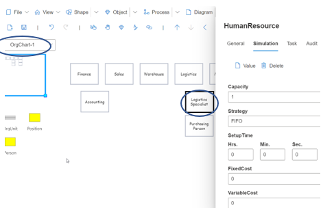

# Simulation

SemTalk Online includes the ability to use **Simulation-Specific Properties** to dynamically analyze process flow information. Object characteristics and execution flows are analyzed to estimate variables such as Waiting Times and Costs. Users can also customize these attributes to execute more sophisticated simulations, or to create custom dialogs related to dynamic behavior. 

**EntryPoint Simulation Properties**:
* Process Start and End Times
* Priority
* Distribution Type
* Jobs
* Period
* WorkTime
* WorkTime2

**Task Simulation Properties**
* CostDriver
* Priority
* Distribution Type
* WorkTime
* WorkTime2

**SequenceFlow Association Simulation** Properties
* TransportationTime
* FixedCost
* VariableCost
* Probability
* ConditionExpression
* Restart

**Buffer Simulation Properties**
* Capacity
* FixedCost
* InitialContents
* FlushTime
* FlushNumber

**HumanResource Simulation Properties** 

**NOTE**: Simulation Properties are edited in the OrgChart
* Capacity
* Strategy
* SetUpTime
* FixedCost
* VariableCost

Right mouse click on an **EntryPoint, Task, Buffer or Association Object** in a Business Process and select **Properties** to access **Simulation Properties**. Right mouse click on a **HumanResource** in an **OrgChart** to open **HumanResource SimulatiomProperties**.

