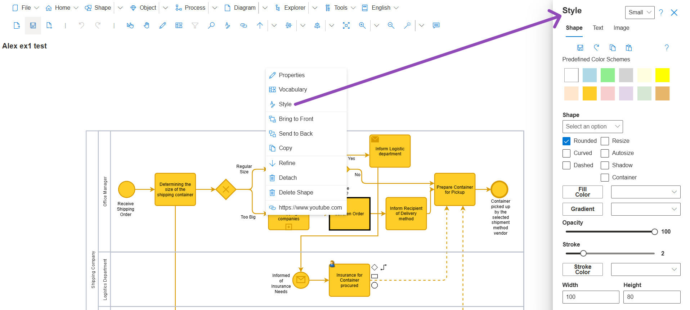

# Style

**Style** contains the commands used to customize the visual Style of Objects. 

## Style Types

- **Shape**
- **Text**
- **Image**

## Shape Options
- **Shape**: Object Shapes that can be applied to a target Object and Shape format options for the selected Shape
- **Opacity**: Transparency of the Object's fill color
- **Stroke**: Selected Object's Rrame color and size 
- **Width/ Height**

## Text Options

## Style - Image Options

Style Image allows users to import external Images into their model. For additional information: 

## Style Icon Menu

- **Save**: Save the custom Style features for the Object
- **Reset** (Undo Icon): Resets the Style format to the SemTalk Online default values
- **Copy**: Copies the format of a selected Object and applies it to a target Object
- **Paste**: Copies the copied format to the target Object.

