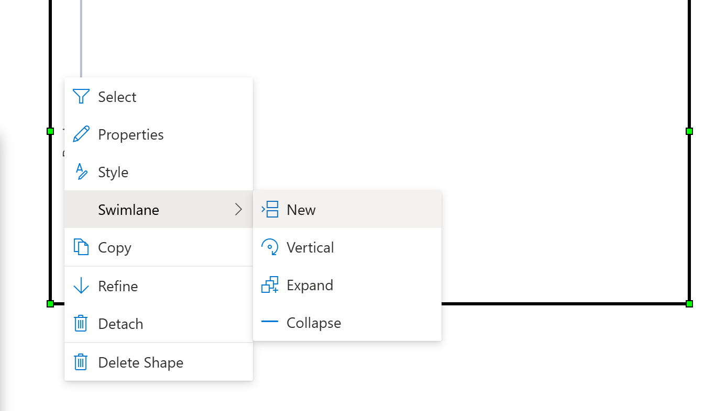
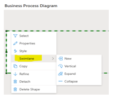
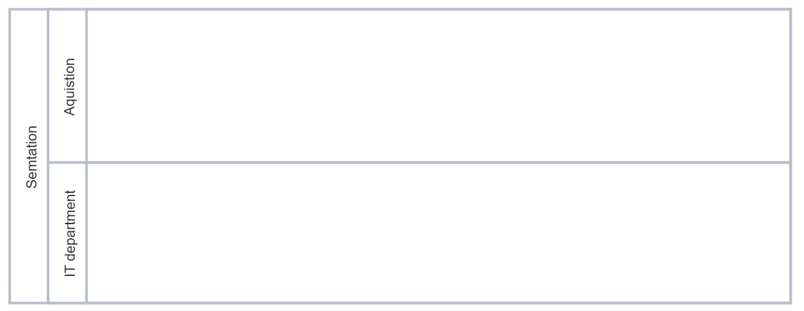
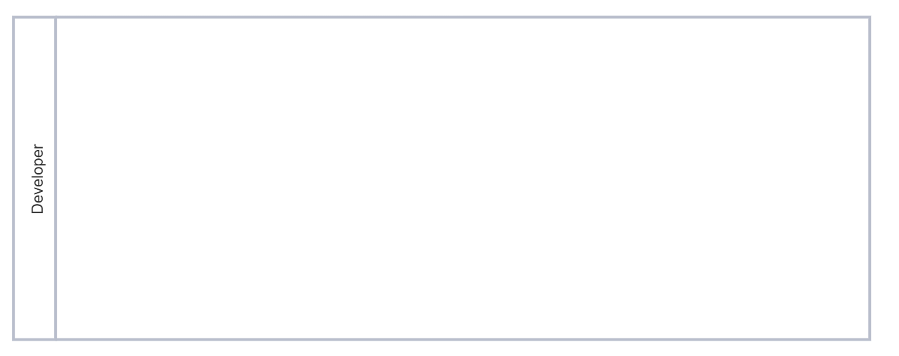
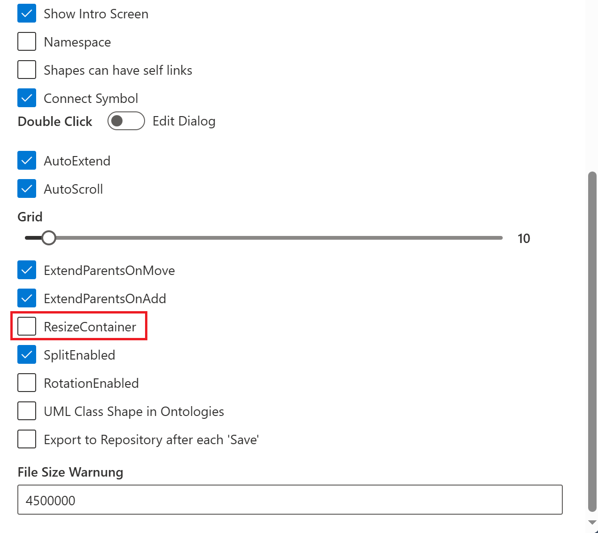

# Swimlanes and Swimlane Pools

**Swimlanes** and **Swimlane Pools** are used in Business Process Diagrams to visually and structurally show who, or what, is responsible for each process step. Process flows shown between Swimlanes describe how the process flows between different actions and/or actors.

**Swimlanes** show the Tasks/ Events and the process flows that are executed by a single group.

**Swimlane Pools** contain multiple Swimlanes. Each Swimlane in the pool represents a subgroup of the higher level Swimlane. e.g. HR, Sales and Logistics are all subunits of Corporation X. Each department has Units or Teams within the department that execute different Tasks.

**NOTE**: When working with **Swimlanes** and **Swimlane Pools** it is recommended to first create and position all Swimlanes/ Swimlane Pools before placing any other Objects onto your Diagram because future editing becomes more complicated due to the container behavior of Swimlanes and Swimlane Pools.

Create a **New Swimlane** :
* Drag and drop a **Swimlane** from  the **Stencil** onto a **Business Process Diagram**, 

* In the main **Process Pull-Down** menu select **Swimlane - New**

  

* Right mouse click on an existing **Swimlane** and select **Swimlane - New**

  

Group multiple **Swimlanes** into a **Swimlane Pool**: 

Right click on the Header of the **Swimlane** or **the Swimlane Pool** and select **Swimlane - New**. SemTalk Online will then create a **Swimlane Pool** that shows the New Swimlane within a higher level Swimlane Pool. As additional Swimlanes are added, the top level Swimlane size will not automatically change unless the Resize Option is on. Please refer to Resize Option shown below.

Manually resize the Swimlane by right clinking and holding down the curson on the lower corner of the Header to adjust the size to fit the newly added Swimlane. 

The Pool **Semtation** contains two Swimlanes - **IT department** and **Aquisition**).

A single Swimlane.

Swimlanes can be displayed **Vertically or Horizontally**. **Horizontally** is the default setting. There are the two ways to switch from Horizontal to Vertical:

* Right click on a existing Swimlane and select **Swimlane - Vertical** 

* Click on the top level Swimlane and use the **Process - Swimlane** pull-down menu.

Swimlanes can be Collapsed or Expanded:

* Right click on an existing Swimlane. Select **Swimlane - Expand** or **Swimlane - Collapse** from the context menu or in the main **Process" - Swimlane -  Expand or Collapse** menu.

**NOTE**: If a Swimlane is deleted, all of the Tasks will be deleted be deleted from the model unless the Tasks appear on other Diagrams. Other Object types, such as OrgUnits and Resources, are deleted from the Diagram but not deleted from the model.

**Edit a Swimlane's Size**

The size of Swimlanes and Swimlane Pools can be adjusted individually. 

  Left click on a Swimlane. The active Swimlane will turn green and it will show resizing handle points. Hover your mouse over a handle point until the up and down arrow appears then adjust the Swimlane to the desired height or width.

**Connect Swimlanes**:
 
 Select the Swimlane by holding down the cursor on the Swimelane's Header. Drag the Swimlane to the edge of Target Swimlane's position. A dashed dark red line will appear. Release the cursor to connect the two Swimlanes.

## ResizeContainer
Pools and Swimlanes can be edited using the "ResizeContainer" option.

- Left-click on Settings 
 
* Scroll down to the option "ResizeContainer"
* Click **ResizeContainer** checkbox to activate.

### ResizeContainer On
If "ResizeConatiner" is activated, higher level Swimlanes will change their size as new lower level Swimlanes are added.

**NOTE**: When **ResizeContainer** is activated it is ony possible to change a Pool size indirectly, by adjusting the size of the Swimlanes contained in it.

### ResizeContainer Off
When "ResizeContainer" is deactivated, Swimlane Pools will not adjust automatically to the size of their lower level Swimlanes. Pool size can be adjusted manually, but manual changes will automatically change the size of the other sublevel Swimlanes.

**NOTE**: In general, when adjusting the size of Swimlanes within a Pool, it should be noted that the outer Swimlanes cannnot be enlarged or reduced via their resizing handle points if they are located outside of the Pool. 
