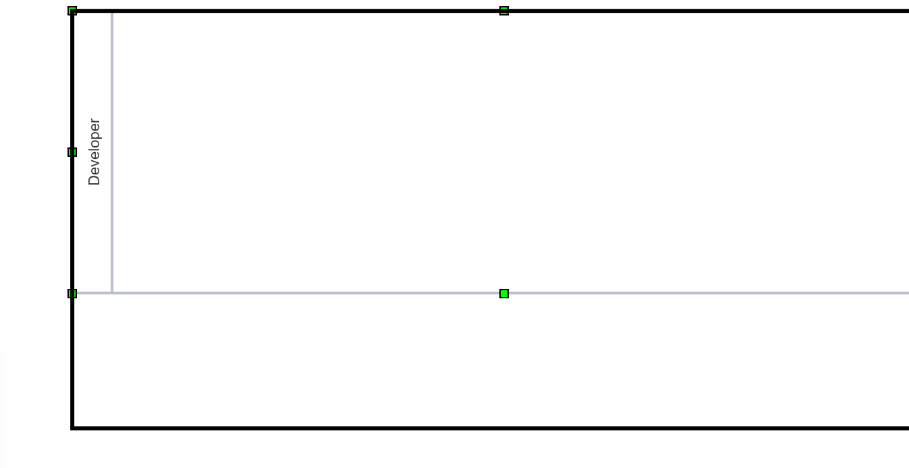

**Swimlanes and Pools** are used to display processes structured according to processing units. This practice originates from BPMN Notations and is generally used there. However in SemTalk Swimlanes are available for other notations, e.g. EPK.

Further distinction is made between: 
**Pool:** represent greater organisations, e.g. Corporations or entire departments. A Pool comprises multiple Swimlanes. 
**Swimlanes:** represent processors. These can be, depending on the level of detail, persons, roles or smaller organisational units.

A Pool with the organisation "Semtation" includes in the example two Swimlanes ("IT department" and "Aquisition").

A single Swimlane.

**Swimlanes and Pools** can be created by:
* Dragging and dropping a Swimlane object from your stencil icons, 
* Right mouse clicking on an existing Swimlane. In the context menu Swimlane --> New
* In the main menu "Process" --> Swimlane --> New

Swimlanes can be displayed **vertical or horizontal**. "Horizontal" is the default setting. There are the two following options, to switch to "vertical":

* right click on a existing Swimlane. In context menu Swimlane --> vertical  
* in main menu "Process" --> Swimlane --> vertical

Swimlanes are collaps- and expandable:

* right click on a existing Swimlane. In context menu Swimlane --> expand or collapse
* in main menu "Process" --> Swimlane --> expand or collapse

**Caution:** If a Swimlane gets deleted, all its contained shapes will be deleted aswell. 

# Movement and size adjustmend of Swimlanes

The size of Swimlanes and Pools can be adjusted individually. To do this, select a Swimlane by left-clicking it. The size can then be adjusted at the respective green shift points.
* move mouse cursor on shift point
* mouse cursor will turn into double arrow, wich specifys in wich direction the Swimlane can be adjusted

If required, Swimlanes can be moved, connected to one another or added to Pools.
* hold left-click on to the edge or the header of a Swimlane to move it
* to connect Swimlanes, attach their edges to each other until a dashed red line appears and release cursor to connect them
* to add a Swimlane to a Pool, move it into the Pools header

# ResizeContainer
In SemTalk, to edit Pools and Swimlanes, the option "ResizeContainer" can be used according o preference.
* in user interface left-click on the cogwheel at the top right
* in options menu scroll down to the option "ResizeContainer"
* by default "ResizeContainer" is deactivated, to activate check the little white box with left-click

# ResizeContainer on
If activated "ResizeConatiner" will insure that, Pools will always adjust their size to the Swimlanes its containing, when their size is being changed.

**Important:** With "ResizeContainer" activated a Pools size can only be changed indirectly, by adjusting the size of the Swimlanes contained in it.

# ReszeContainer off
When "ResizeContainer" is deactivated Pools will not adjust themself automatically to the sizes of their contained Swimlanes. In this stage Pools sizes can be adjusted manually, however so does the size of Swimlanes.

**Important:** In general, when adjusting the size of Swimlanes within a Pool, it should be noted that the outer Swimlanes cannnot be enlarged or reduced via their shifting points that are located on the outside of the Pool. 
