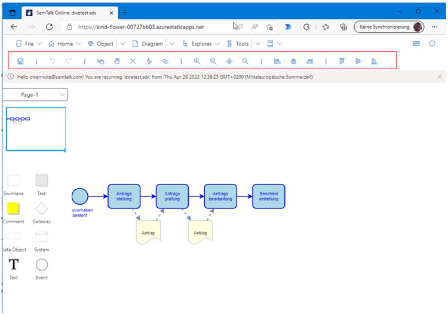

# Toolbar

The SemTalk Online's fixed Toolbar contains the following icon-based commands:
- Open
- Save
- New
- Undo/Redo
- Pointer Tool, 
- Hand
- Properties
- Vocabulary
- Select
- Search
- Style
- Attachments
- Go Up/ Go Down
- Align
- Center Drawing
- Zoom In/ Zoom Out
- Layout
- ChatGPT