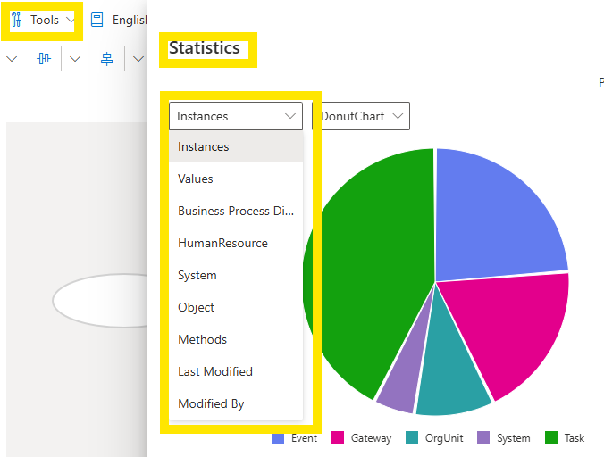

# Tools

The **Tools** pull-down menu contains SemTalk Online's tools that are used to manage the entire model's content.

### [**TOOLS**](https://github.com/SemTalkOnline/SemTalkOnline_EN/wiki/SemTalk-Settings)

**Settings**: Link to the Settings window

**Portal Export Connections**: Portal parameter settings

**Export to Portal**: Exports all new Diagram terms into the **Repository**

**Statistics**: Charts of Tasks, Gateways, Events and Resources with links to the Diagrams where they appear

**Report**: Creates specific Reports based on selected model parameters

**Check Model Consistency**: Checks Tasks, Gateways, Events and their Associations to determine if they conform to BPMN rules

**Check and Repair**: Fixes Diagram Shape errors

**Redraw all Symbols**: Redraws all Tasks, Events, and Gateways to reflect changes or to fix Objects that were loaded incorrectly

**Reload Site**: Refreshes SemTalk Online without requiring re-login. (NOTE: Placement of graphics may be lost during reload)

**Customize**: Provides **Image Manager** to manage external Images and Diagram **Header/Footer** information is managed here

**ChatGPT**: Link to ChatGPT to ask questions about model content and to import external ChatGPT generated Objects into a SemTalk Online model

**Termstore**: Connection to Microsoft Termstore

**Consent**: Manages Model User Rights (NOTE: Only Model Adminstrators can manage user rights.)