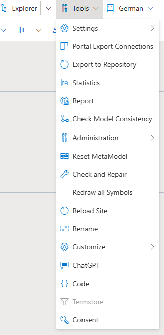

# Tools

[**TOOLS**](https://github.com/SemTalkOnline/SemTalkOnline_EN/wiki/SemTalk-Settings)

**Settings**: This is a link to the Settings window

**Portal Export Connections**: This is where all of the parameters for the Portal are set

**Export to Portal**:
This exports all of the new terms that are used in a diagram and is put into the repository that the user has for later use

**Statistics**: Relays through either numbers, charts, or graphs the number and type of tasks, gateways, and events that are used in a diagram

**Report**: This is where users can create specific reports based on selected parameters for the model content.

**Check Model Consistency**: The user is able to check if their model makes sense in terms of task, gateways, and events correctly lining up with one another with a focus on BPMN rules

**Check and Repair**: The Feature fixes errors in the program that have caused abnormalities in the viewing the diagram

**Redraw all Symbols**: This will cause the symbols on tasks, events, and gateways to be reloaded in case they are changed or loaded incorrectly

**Reload Site**: The website is reloaded and all unsaved work is lost (no re-login required)

**Customize**: This allows users to add a specific header/footer that is put on the corner of the page with the diagram, as well as help to manage the various images that can be inputted in the 

**ChatGPT**: This is an extension to use ChatGPT to ask questions involving the BPMN Diagram 

**Termstore**: This is the connections to Microsoft Termstore

**Consent**: This allows Model Adminstrators to manage user rights