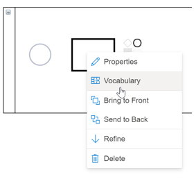

# Vocabulary

## Naming Task Objects Using Vocabulary

In addition to naming **Task Objects** by:
1.  Double-clicking on the **Object**,
2.  Right mouse click - **Properties** 

SemTalk Online also has the **Vocabulary** structured **Task** naming option comprised of **Objects** (nouns), **Methods** (verbs) and **States** (status). 

When **Tasks** are named using **Vocabulary**, picklists are shown with all available **Object**, **Method** and [**State**](https://github.com/SemTalkOnline/SemTalkOnline/wiki/State) names. Users can choose from the picklist or, if the Objects are not in the picklist, they can add additional **Objects**, **Methods** and **States** to the picklist for future use. This is keeps the **Vocabulary** used in the model consistent.

For example, the **Task** (process step) 'Send Invoice' consists of the **Method** 'Send' and the **Object** 'Invoice'. **Gateway** names, such as 'Invoice Paid', consist of the **Object** 'Invoice' and the **State** 'Paid'. 

**Vocabulary** picklist names are saved in model-specific Libraries of **Objects**, **Methods** and **States**. If desired, the model's **Administrator** can upload a model's local Repository into the organization's central **Repository** so that it can be used by all modeling teams in the organization. Not only does **Vocabulary** keep the naming process consistent, it also standardized the interfaces that define how information flows between different models so that model data can easily be linked or imported/ exported between modeling teams.

Right-mouse click on a new Task and select **Vocabulary**.

A **Vocabulary** Window will open with pull-down lists of available **Objects** (Nouns), **Methods**(Verbs) / **States** (status) currently in the [Repository](https://github.com/SemTalkOnline/SemTalkOnline/wiki/Repository). As new **Object**, **Method** and **State** names are added, they will automatically be added to the [Repository](https://github.com/SemTalkOnline/SemTalkOnline/wiki/Repository). 

