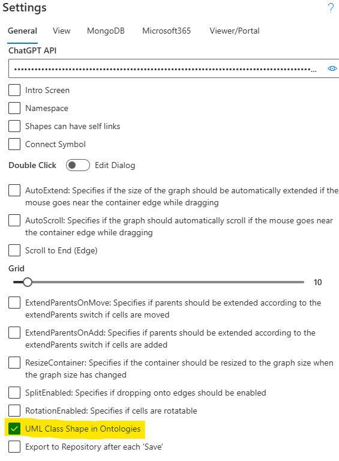
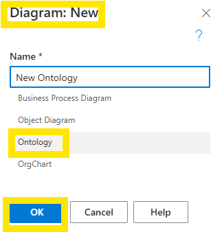
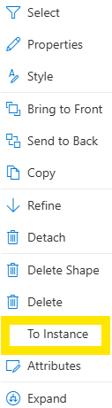

# Working with Ontologies

## Introduction

SemTalkOnline allows users to create knowledge models in the form of **Ontologies**. Ontological classes are groupings of things that have common properties or that are subsets of classes within a specific domain. 

Ontologies can be modeled independently in an Ontology Model using SemTalk Online's Ontology Template or they can be created within within the BPMN or EPC Models. BPMN and EPC models can be linked to Ontology Models to support bi-directional sharing of ontological information. Ontological modeling options are discussed in more detail below.

## Class Representations

SemTalk Online distinguishes between two types of ontological Class representations. The first is the standard Class representation that shows  geneneral ontological concepts and their relationships to one another. The second is for the specific Instances of those Classes.

In the above example, classes are represented as white ellipses, while instances are represented as gray ellipses. 

Ontological Classes can also be represented in accordance with UML standards as rectangles. The rectagular option shows both the Class name and the Methods (verbs) associate with the Class.

Select the **Settings - General - UML Class Shape in Ontologies** to use UML Notation.

Note: The default color scheme can be changed at any time using **Style**.

## Create a New Ontology

Select **File -  New** from the main pull-down menu. Then select **Ontology** as the new model type and select **New**.

SemTalk Online will open the **Ontology** model template with the standard default Class representations or with the **UML** representation if it was selected in **Settings - General**.

**Ontology** model templates do not have process flow representations, they only contain ontological information. If process flow descriptions need to be shown along with their core ontologies, use the **BPML or EPC** model templates to show both process flows and ontologies. 

When **BPMN or EPC** models are used to create ontologies in business process models, the model **Administrator** needs to add the Ontology function to the model by selecting **Diagram - New - Ontology** in the main pull-down menu.

SemTalk Online will suggest to name the Diagram **Ontology-1**. Users can rename the Diagram but it is helpful to give the Diagram a new name that differenciates **Ontology Diagrams** from other **Object Diagram** types.

## Working with Ontology Model Templates

In **Ontology** template models, the following **Ontology Stencil Shapes** can be dragged and dropped onto the Diagram:
- Class
- Instance
- Comment
- Text
- Image

## Modeling with QuickShapes

**Quickshape** allows users to directly model related Objects and Connectors by hovering the cursor over an existing source shape and selecting one of the following Shapes:

#### Circles Used to Create New Objects with Associated Connectors:
- Dark Blue Circle: Creates an Instance of the source Class
- Light Blue Circle: Creates a new source Object Superclass

#### Connectors to Link Existing Objects:
- Straight Line: Creates a Subclass relationship between Subclass source Object and the Superclass target Object.
- Perpendicular Line: Creates an Instance of a Class

**NOTE**: When using Quickshapes to add Objects, Object placement is limited to a parallel or lower position than the position of the Superclass. 

## Showing/ Hiding Attributes

SemTalk Online allows existing Class Attributes to be displayed in Ontologies by activating UML Shapes in **Settings - General - UML Class Shape in Ontologies**.

Once activated, users right-click on a Class to open **Attributes**. Click on the **Attribute** name to Show or Hide the Attribute.

It is possible to change an Ontology Object from a Class to an Instance or an Instance to a Class.  **Classes** or **Instances**. 

Right mouse click on a Class or Instance and select **To Instance** or **To Class**.

The **Color and Properties** of the Object will change accordingly.

### Connectors

Relationship between two ontology classes can be created using the perpendicular QuickShape line (Refer to the QuickShapes section above). Select the Class' **QuickShape** and drag the arrow that appears to the Class to the desired target Object. SemTalkOnline automatically names the relationship according to the default settings.

For example, a 'Car' **Consists of** a  'Axel', which **Consists of**  'Wheels'. If you what to model that 'Wheels' make contact with the road, it requires another relationship, such as 'has contact with'. This requires creating a relationship between a 'Wheel' and the 'Road surface'. Add this new relationship by double-clicking on the relationship between the two Objects and change its name to 'has contact with'.

SemTalk Online then stores the new relationship in the model and it will be visible in **Explorer - Associations** that shows Associations linked to the class 'Wheel'. 

The additional relation “has contact with” is highlighted in yellow.

**NOTE**: Relations are directed, which can be seen from the angles in front of the relation name in the tab. In the graphical representation, relations are shown as arrows with a direction.

## Linking Ontologies with Business Process Models

SemTalk Online is able to integrate additional Business Process Object knowledge as associated Ontologies. Integration is built on business process objects that have been defined using the Vocabulary naming structure. 

Check to see if a model is built using Vocabulary by opening thea Business Process Diagram in the model, right mouse click on an Task and select Vocabulary. Vocabulary will show the Object Name and the Method Name. If those fields are blank, it is not a Vocabulary model. 

Selecting an existing Object for referencing in an ontology
Open an Ontology Diagram and right mouse click anywhere on the Diagram and select **Insert**.

A dialog will appear with available **Objects**. These **Objects** can then be **Inserted** onto the Ontology Diagram.

**NOTE**: In order to only insert Objects, set **Metamodel** column to “Object”.

