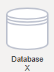
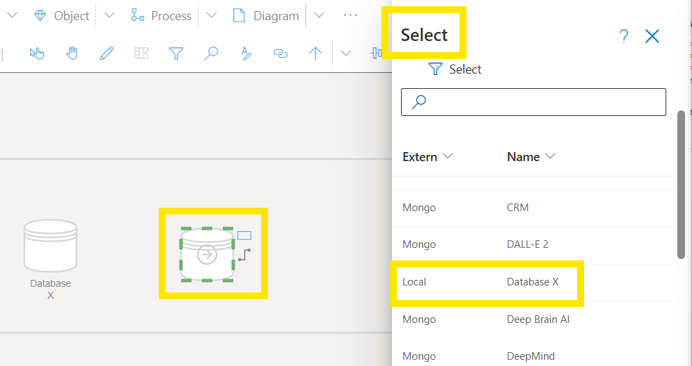

## Working with Objects

Building models using centralized core **Objects** descriptions simplify the management and editing of **[Object Properties](https://github.com/SemTalkOnline/SemTalkOnline/wiki/Properties)** (e.g. Comments, Attributes, or embedding links). Information modeled in **Class Objects** is automatically inherited by all **Instances** of the Object, in all process flow Diagrams. This makes it easy for process owners to continually update and/ or edit process flow descriptions as needed.

Object-based elements include:
- Roles/process participants (BPMN)
- Systems/data storage (BPMN)
- Data objects (BPMN)
- Organizational units
- Service (EPK)
- Material resources (EPK)
- Class (EPK)
- Technical terms (EPK)

## Add/ Edit and Object Name

Here is an example using a BPMN System:

Drag and drop a System shape from the Stencil onto a Diagram. Then right click  on the newly created System, select Properties and add a the name Database X. 

A new System Class has now been created. Drag and drop a new System shape onto your Diagram. Right mouse on the new System and click on Insert. The newly created Database X will appear as a System Class.

The SemTalk Online **[Ontology](https://github.com/SemTalkOnline/SemTalkOnline/wiki/Workin-With-Ontologies)** version only contains Object Diagrams. All other SemTalk versions contain **Object Diagrams** as a **Diagram Type**. Objects defined in Object Diagrams become **Object, Method and State** Picklists in the **[Vocabulary](https://github.com/SemTalkOnline/SemTalkOnline/wiki/Vocabulary)** dialog when modeling new process flows. 

SemTalk Online is built using object-oriented modeling concepts. All SemTalk Online versions contain Class **[Diagrams](https://github.com/SemTalkOnline/SemTalkOnline/wiki/Diagram-Overview)** where core modeling elements, and their **[Properties](https://github.com/SemTalkOnline/SemTalkOnline/wiki/Properties)**  and **[Associations](https://github.com/SemTalkOnline/SemTalkOnline/wiki/Associations)**, are modeled. **Objects** in **Object Diagrams** are presented to modelers in **Object Picklists** that are used as process flows are defined.

As **New Objects** are added via **[Vocabulary](https://github.com/SemTalkOnline/SemTalkOnline/wiki/Vocabulary)**, **New Object Names** are automatically added to the **Object Class Picklists**. Newly defined Objects are then added to the **Object Class** Diagram via the right mouse click, **Insert** command in an **Object Diagram**. 

**NOTE**: When defining **Tasks, Events and Gateways** using **[Vocabulary](https://github.com/SemTalkOnline/SemTalkOnline/wiki/Vocabulary)**, **Nouns** = **Objects**, **Verbs = Methods** and **State conditions = States**.

### Important tips when working with **Objects**:

**Create an Object**:
* Drag and drop Objects from the **Stencil**
* Import Objects from **Excel** or from a **Repository**

**Name an Object**:
* Double click on the **Object**, 
* Open the Object's right-mouse click menu
* Use the **[Vocabulary](https://github.com/SemTalkOnline/SemTalkOnline/wiki/Vocabulary)** naming option 

**Connect Objects**:  
* Hover your cursor over the center of an Object until the hand icon appears. Hold down your cursor and draw the connection to the next object. 
* Right mouse on an Object and select a target Object

Connection types are dependent on the **Diagram Type**. Users are able to create user-defined connectors but it is generally not recommended because user-defined connectors are not considered when running process flow consistency checks.

SemTalk Online's object-oriented approach improves overall model accuracy, decreases modeling time, minimizes redundancies (e.g. modeling the same objects using different names) and greatly improves the overall usefulness of models because it centralized management of associated documents and links.