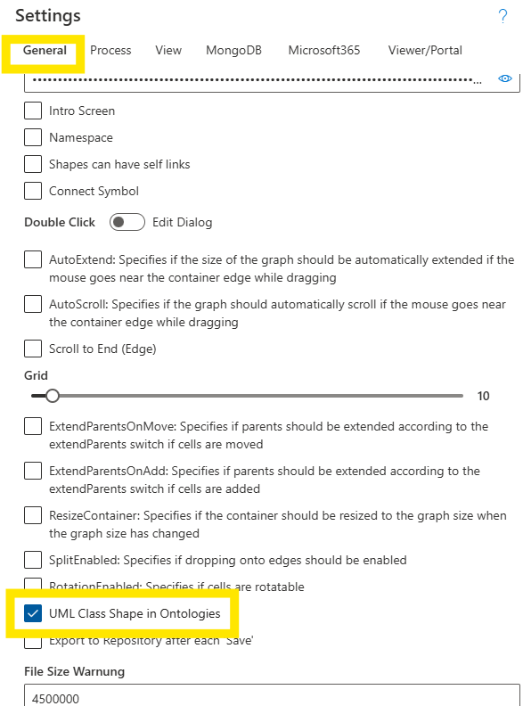

# Working With Ontologies

## Introduction

SemTalk Online is able to create knowledge models in the form of **Ontologies**. **Ontological Classes** are groupings of **Objects** that have common **Properties**, or they are **Classes** within specific **Domains**. 

**Objects** modeled using **Ontologies** are integrated into the picklists used when modeling. These picklist **Objects** inherit the **Properties** defined in the **Ontology**.

Ontologies can be modeled independently in an **Ontology Template Models** or they are created within  **Business Process** and **EPC Models** when using the **Vocabulary** function when naming process flow Objects. 

**NOTE**: If an **Ontology Model** exists, the Objects in the Ontology Model can be integrated into **Business Process** and **EPC Models** using the Meta Model that is used to share process model data in all modeling activities within an organization.

## Create an Ontology Model

 Select the **Ontology Modeling Template** option when creating a **New Model**. 

**Class Representation**

SemTalkOnline distinguishes between two types of representations: Ontological **Classes** and **Instances of Classes**.

In the above example, **Classes** are represented as white ellipses, while **Instances** are represented by gray ellipses.

Ontological Classes can also be represented as rectangles in accordance with the UML standard. These UML views show associated **Method** names in addition to the **Class** names. Please refer to the Showing/ Hiding Attribute section shown below.

**NOTE:** The default color scheme for Ontology Objects can be changed using **Style**.

## Create an Ontology in Process Models

**BPMN or EPC** SemTalk Online versions can add ontological components by integrate **Ontology Diagrams** into models. 

Select **Diagram - New - Ontology**. 

**NOTE**: If **Diagram - New - Ontology** is not shown in the **Diagram - New** pull-down menu, please contact the model's **Administrator** to add the Ontology function to the model.

SemTalk Online's Ontology Diagram's default name is **Ontology-1**. Users can rename the Diagram but it is helpful to give the Diagram a new name that differentiates it as an **Ontology Diagrams**.

**Working with Ontology Diagrams**

**Ontology Diagrams** have specific associated **Object** shapes in their **Stencil**.
* **Class**
* **Instance**
* **Comment**
* **Text**
* **Image**

## QuickShapes

**QuickShapes** allow modelers to quickly create linked **Objects** by hovering the mouse over an existing shape and then choosing the desired Object type that should be connected.

 **QuickShapes** modeling elements:
* Instance (gray box): Creates an instance of the Class
* Superclass (arrow): Relationship of the class to a superclass
* Association (angled line): Relationship between two classes

## Showing/ Hiding Attributes

SemTalk Online allows existing Class Attributes to be displayed in Ontologies by activating UML Shapes in **Settings - General - UML Class Shape in Ontologies**.

Once activated, users right-click on a Class to open **Attributes**. Click on the **Attribute** name to Show or Hide the Attribute.

It is possible to change an Ontology Object from a Class to an Instance or an Instance to a Class.  **Classes** or **Instances**. 

Right mouse click on a Class or Instance and select **To Instance** or **To Class**.

The **Color and Properties** of the Object will change accordingly.

### Connectors

**Ontology Quickshapes** have two primary connector types:
* Subclass (straight arrow) or 
* Relationship (angled arrow): SemTalk Online automatically names the relationship **Consists of** according to the default settings.

For example, a 'Car' is a subclass of Vehicle. A 'Car' **Consists of** an 'Axel', which **Consists of** 'Wheels'. The **Consists of** Relationship can be freely defined as needed.

If the model requires a different relationship, such as, Wheels 'have contact with the road'. This new Relationship is created by double-clicking on the **Consists of** Relationship and changing its name to 'have contact with the road'. 

This new relationship is automatically added to the model as an available Relationships. Available Relationships are listed in **Explorer - Associations**. It shows the **Associations** along with its linked **Class** Objects. e.g.'Wheels'. 

**NOTE**: Relationships go in a direction. that is appears as a directional arrow. 
