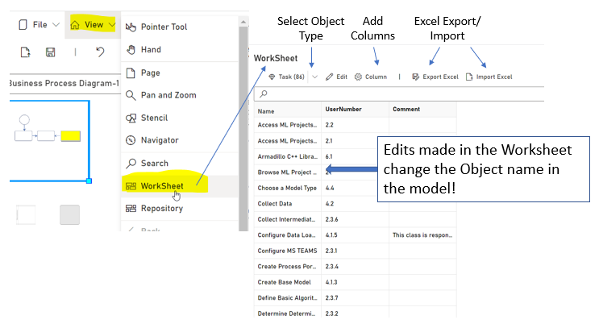

Worksheet makes it easy to edit Object Names by giving you a configurable table editor. Select the Object type and all Object of that type will appear. Add UserNumber, Comment, English and German columns to manage those elements of the selected Object.

